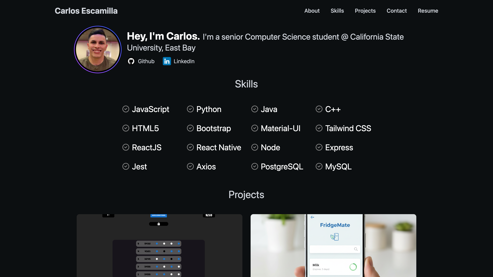
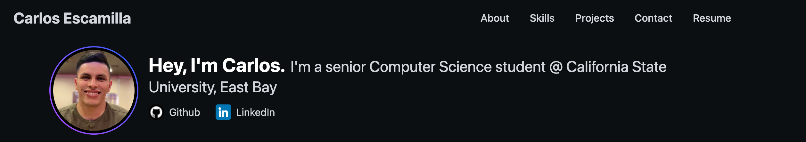
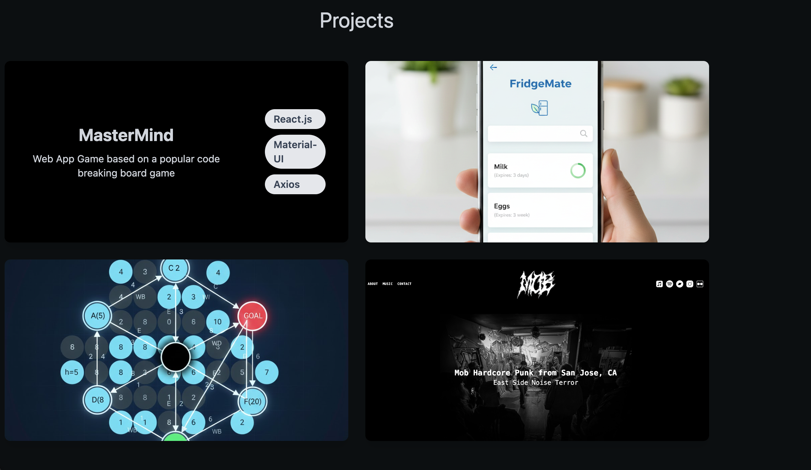
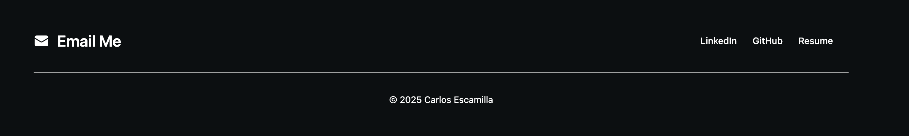
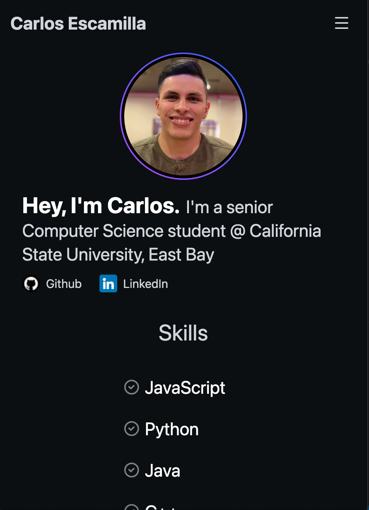
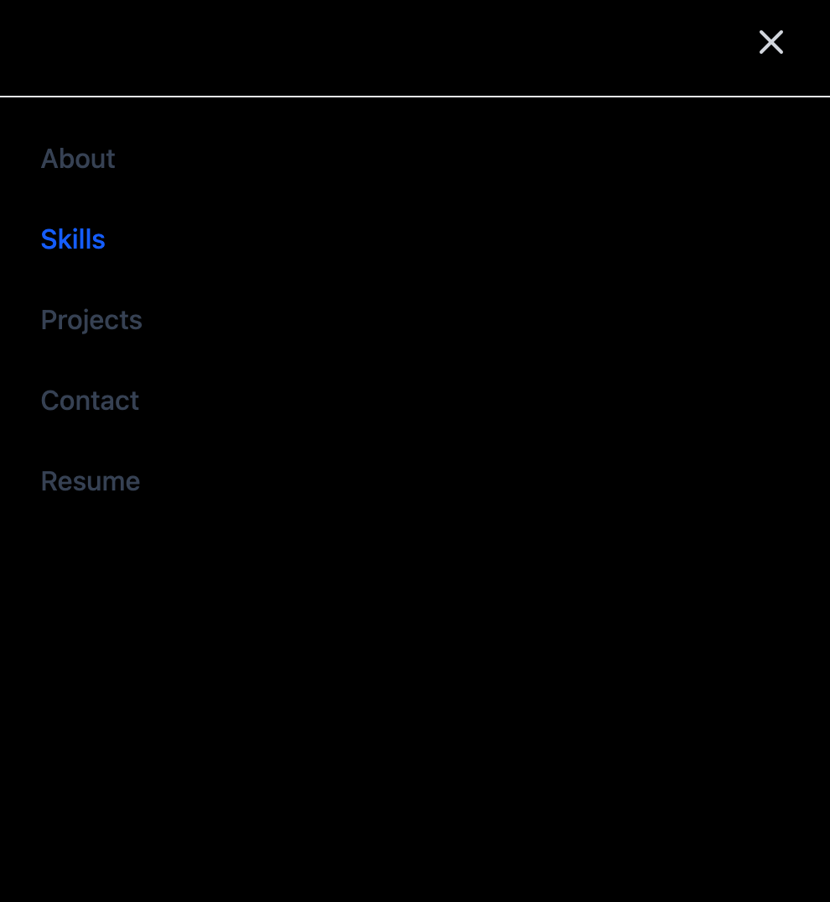

# 🌐 Personal Portfolio Website

This is my personal portfolio website built to showcase my projects, skills, and background as a software engineer.  
The site is designed as a clean, single-page layout with smooth navigation and responsive design.

---

## 🚀 Live Demo  
👉 **https://your-website-link.com**

---

## 📸 Screenshots

### 🏠 Home / Hero Section

### 👤 About Me Section

### 📂 Projects Section

### 📬 Contact Section

### 📱 Responsiveness

> Create a folder named `screenshots` in your repo and drop your images in there.  
> You can use `.png`, `.jpg`, or `.webp`.

---

## 🔧 Tech Stack

- **Frontend:** HTML, CSS, JavaScript
- **Framework/Libraries:** React, Tailwind CSS
- **Deployment:** GitHub Pages

---

## ✨ Features

- Smooth single-page layout  
- Clean and modern UI  
- Mobile responsive  
- Projects showcase  
- About + Skills + Contact sections  
- Quick navigation links  

---
